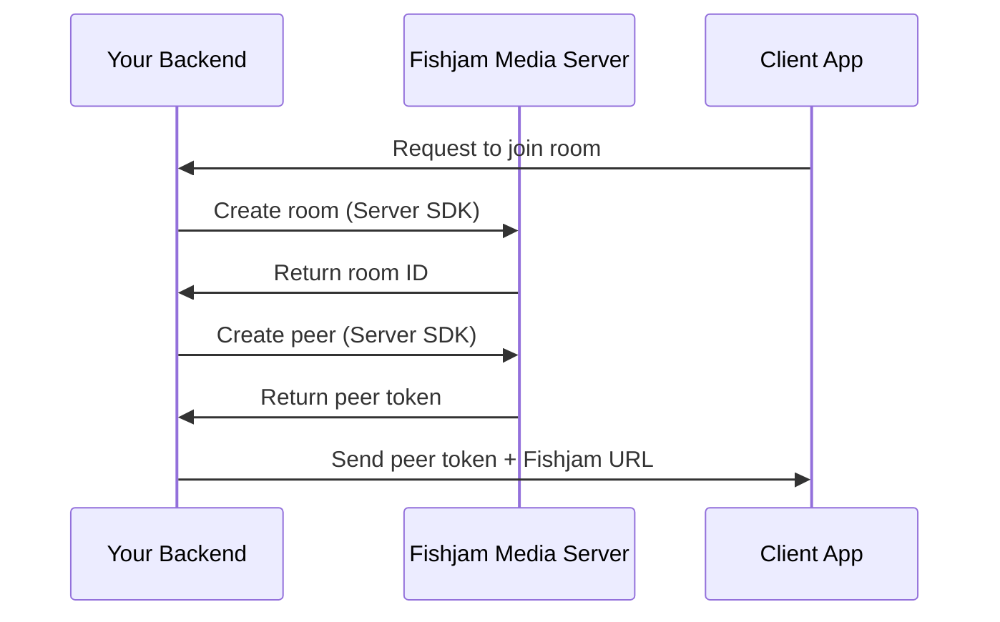
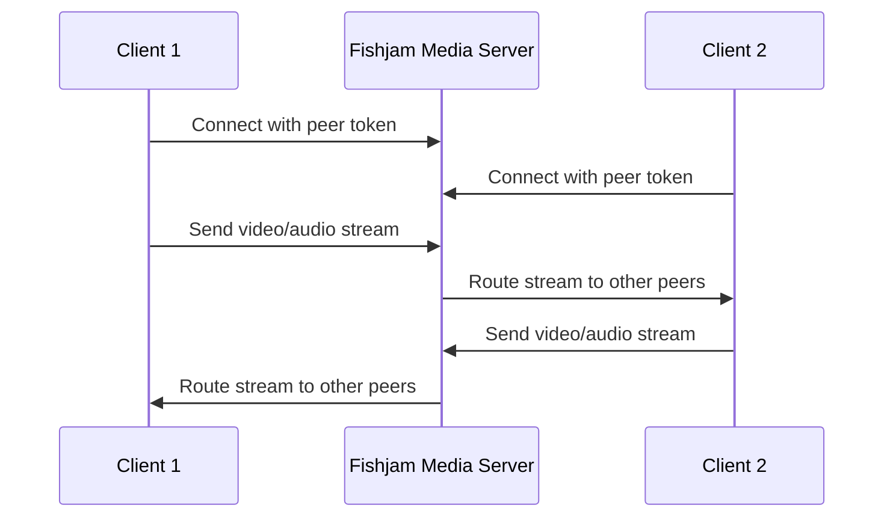

# Fishjam Architecture

**Explanation** - _Understanding how Fishjam works under the hood_

This document explains the technical architecture of Fishjam and how data flows through the system.

## High-level Architecture

Streaming with Fishjam is simple: you create a room, add peers to it, and start streaming. Below is a high-level overview of how Fishjam works.


## Components Overview

### 1. Your Backend Server

Your application's backend server is responsible for:

- Authenticating users
- Creating rooms using Fishjam Server SDKs
- Generating peer tokens for clients
- Managing room lifecycle and permissions

### 2. Fishjam Media Server

The Fishjam Media Server is the core infrastructure component that:

- Routes audio and video streams between participants
- Handles WebRTC negotiations and connections
- Manages different room types (full-feature, audio-only, livestream)
- Processes and transcodes media when needed
- Enforces security policies and token validation

### 3. Client Applications

Client applications (React Native, React/Web) use Fishjam Client SDKs to:

- Connect to rooms using peer tokens
- Send and receive audio/video streams
- Handle device management (cameras, microphones)
- Manage connection state and reconnections

## Data Flow

### 1. Room Creation Flow



### 2. Media Streaming Flow



## Room Types and Architecture

### Full-feature Rooms

- **Purpose**: Multi-participant video conferencing
- **Media flow**: Peer-to-peer through media server (SFU architecture)
- **Scaling**: Supports many participants efficiently
- **Features**: Screen sharing, multiple video tracks, audio controls

### Audio-only Rooms

- **Purpose**: Voice-only communication
- **Media flow**: Audio-only routing with optimized bandwidth
- **Scaling**: Highly efficient, supports more participants
- **Cost**: 75% cheaper than full-feature rooms

### Livestream Rooms

- **Purpose**: One-to-many broadcasting
- **Media flow**: Single broadcaster to multiple viewers
- **Protocols**: Uses WHEP/WHIP standards for viewers
- **Scaling**: Optimized for high viewer counts

## Security Architecture

### Token-based Authentication

1. **Management Tokens**: Secure your backend-to-Fishjam communication
2. **Peer Tokens**: Short-lived tokens for client access to specific rooms
3. **Token Validation**: All client connections validated by media server

### Network Security

- All media streams are encrypted using WebRTC's built-in encryption
- HTTPS/WSS connections required
- No direct peer-to-peer connections (everything routes through Fishjam)

## Scaling and Reliability

### Media Server Scaling

- Automatic scaling based on load
- Geographic distribution for low latency
- Redundancy and failover handling

### Client Resilience

- Automatic reconnection handling
- Network change detection
- Graceful degradation on poor connections

## Integration Patterns

### Development Pattern (Room Manager)

For development and testing:

```
Client App <-> Room Manager <-> Fishjam Media Server
```

### Production Pattern

For production applications:

```
Client App <-> Your Backend <-> Fishjam Media Server
```

## Supported Protocols and Standards

### WebRTC Standards

- **DTLS-SRTP**: Secure media transport
- **ICE/STUN/TURN**: NAT traversal and connectivity
- **SDP**: Session description and negotiation

### Streaming Protocols

- **WHEP**: WebRTC-HTTP Egress Protocol (for viewers)
- **WHIP**: WebRTC-HTTP Ingress Protocol (for broadcasters)

### Codecs Supported

- **Video**: H.264, VP8
- **Audio**: Opus, G.711

## Next Steps

To understand different room types in detail, see [Room Types Explained](/explanation/room-types).

To learn about security and token management, see [Security & Token Model](/explanation/security-tokens).

Ready to implement? Start with our tutorials:

- [React Native Quick Start](/tutorials/react-native-quick-start)
- [Backend Quick Start](/tutorials/backend-quick-start)
