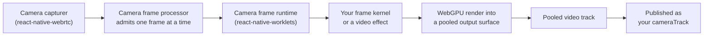

# How camera effects work

[Camera effects](../how-to/client/camera-effects/index.mdx) change the camera video a React Native app publishes: a blurred background, a background image, or anything your own shaders draw. This page explains where effects plug into the Fishjam client, how camera frames reach a worklet and the GPU without copying pixels, and how effects such as background blur are structured.

## Middleware, custom source, or VisionCamera?

Fishjam clients offer three ways to publish processed camera video:

| Approach                                                                           | What it does                                                                     | When to use it                                                                  |
| ---------------------------------------------------------------------------------- | -------------------------------------------------------------------------------- | ------------------------------------------------------------------------------- |
| [Camera track middleware](../how-to/client/camera-effects/stream-middleware.mdx)   | Replaces the camera track Fishjam captures with a processed one before it's sent | Effects on the regular camera; peers receive them as your `cameraTrack`         |
| [Custom sources](../how-to/client/custom-sources/index.mdx)                        | Publishes a `MediaStream` your app produced on its own as a `customVideo` track  | Content that isn't the managed camera: renderers, compositors, file playback    |
| [VisionCamera integration](../integrations/vision-camera/vision-camera-source.mdx) | Publishes a VisionCamera feed as a custom source                                 | Your app already depends on VisionCamera for capture, device control or plugins |

Middleware is the default for effects: device selection, permissions, starting, stopping and switching cameras stay with [`useCamera`](../api/mobile/functions/useCamera), and the receiving side needs no changes.

## Where effects plug in

A camera track middleware is a function from the raw camera track to the track that is published instead. The Fishjam client owns when it runs:

- **Every new device track goes through it.** The middleware runs when the camera starts, restarts or is switched, so the raw track is never published while a middleware is set.
- **Publish first, release second.** When a middleware is set or replaced, the client builds the new track, swaps it into the published stream, and only then releases the previous one. Releasing a React Native track disposes it natively, so the order keeps the published stream from ever holding a dead track.
- **The latest request wins.** If a middleware is replaced while it is still setting up, it releases itself as soon as it finishes and is never published. Until a new track is ready, peers keep receiving the previous one.

The middleware and its `onClear` live in the client's camera state, not in a component, which is why an effect stays on across screens until it is cleared with `null`.

## The camera frame pipeline

An effect needs every camera frame, on the GPU, without slowing down the JS thread. React Native has no built-in way to do that, so the pipeline is split across three packages:

### The camera tap

`@fishjam-cloud/react-native-webrtc` exposes a **camera frame processor** for every local camera track, returned by `getCameraFrameProcessor`. A consumer attached to it receives the frames the camera captures, as native buffers: `CVPixelBufferRef`s on iOS and `AHardwareBuffer`s on Android.

Frames are admitted one at a time. While a consumer still holds a frame, newer frames are dropped on the capture thread instead of being queued, so a slow effect lowers its own frame rate but never builds up latency.

### The worklet runtime

`@fishjam-cloud/react-native-worklets` is the consumer. `attachCameraFrameCallback` calls a worklet for every admitted frame on a dedicated **camera frame runtime**: a separate JS runtime with its own thread, created once for the whole app. The JS thread is not involved per frame, and the buffer handoff is a synchronous JSI call, which is why the pipeline requires the New Architecture.

A worklet's closure is copied to that runtime when it is attached. Anything the per-frame code needs, such as GPU pipelines, bind groups and plain numbers, must be created up front on the JS thread and captured.

### The render pipeline

`createCameraFrameProcessorSession` in `@fishjam-cloud/video-effects` turns the tap into a published track:

- It allocates a pool of three GPU-shareable output surfaces and a custom video track that reads from them. One surface can be encoding while the next is being drawn.
- For every frame, it imports the camera buffer into WebGPU as an external texture, already rotated upright, and hands your frame kernel a context with that texture, a command encoder and the next output surface.
- After the kernel has encoded its passes, it submits them once and pushes the surface to the track with a GPU fence, so the video encoder waits for the drawing to finish instead of reading a half-drawn frame. The frame keeps the camera's timestamp.

Pixels stay in native GPU memory from the camera to the encoder; only handles move between the camera, the worklet and the track. The session's track is what the middleware returns, and its `dispose` detaches the tap and frees the pool.

## Effects, sessions and frame kernels

The ready-made effects use the same pipeline. An effect is described in three layers:

- A **video effect** (`createBackgroundBlurEffect`, `createBackgroundImageEffect`) is a plain descriptor: an ID, the segmentation provider it needs, and a function that reads its options.
- Creating the effect for a device builds a **session** on the JS thread: GPU textures, pipelines and, for background effects, the prepared segmentation model.
- The session exposes a **frame kernel**: its GPU objects as plain data, plus worklet functions that encode one frame. Plain data is what lets the kernel be copied into the camera frame runtime.

`createCameraEffectMiddleware` connects the layers: when the middleware runs it creates the session, captures its frame kernel and the effect's current options, and starts a frame processor session whose kernel calls the effect for every frame. Because the kernel works on a copy, options are read once, when the middleware is applied.

### Segmentation

Background effects need to know which pixels belong to the person. The segmentation provider from `typeGpuPersonSegmentation` runs a selfie segmentation model entirely on the GPU, written with [TypeGPU](https://docs.swmansion.com/TypeGPU/):

- The model file is loaded and parsed once per model source and shared by every session that uses the same provider; each session builds its own GPU pipelines for it.
- For each frame, the effect first offers the camera texture to the provider, which encodes the inference into the same command encoder as the effect. The mask the effect composites with therefore belongs to the same frame.
- The effect then blurs the background, or draws the image behind the person, and softens the outline with the mask. When no recent mask is available, for example right after the model has loaded, the frame is published unchanged.

If the model can't be loaded, the session is still created and reports an `"error"` status, and the effect publishes the camera as it is. A failure to create the session at all, for example on a device without the required GPU features, rejects the middleware instead.

## Platform foundations

- **iOS**: camera buffers are imported directly as multi-planar external textures, and output surfaces are IOSurface-backed BGRA8 (`bgra8unorm`). The shared GPU device is requested with the `dawn-multi-planar-formats` feature.
- **Android**: the camera tap converts each camera image to an RGBA `AHardwareBuffer` before handing it over, and output surfaces are RGBA8 (`rgba8unorm`). Hardware buffers require Android 8.0 (API 26).
- On both platforms, frame kernels sample the camera as RGB, so shaders written against `createCameraShaderBindings` with `cameraPixelLayout: "rgb"` work unchanged.

## Where to go next

- [Camera effects how-to guides](../how-to/client/camera-effects/index.mdx): background effects, your own WebGPU effects, frame processing and middleware
- [Background blur tutorial](../tutorials/background-blur.mdx) and [WebGPU effects tutorial](../tutorials/webgpu-effects.mdx)
- [How custom sources work](./custom-sources.mdx): the custom video track pipeline the render sessions build on
- API reference: [Video Effects package](../api/video-effects/index.md), [React Native Worklets package](../api/react-native-worklets/index.md)
