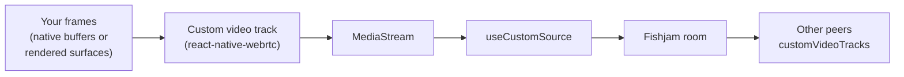

# How custom sources work

[Custom sources](../how-to/client/custom-sources/index.mdx) let an app publish media that Fishjam did not capture itself. This page explains how custom tracks are modeled and routed, when they are published, and how the React Native pipelines move video frames to the encoder without copying pixels and turn pushed PCM into a live audio track.

## Built-in source, middleware, or custom source?

Fishjam clients offer three ways to influence what a peer publishes:

| Approach                                                          | What it does                                                         | When to use it                                                            |
| ----------------------------------------------------------------- | -------------------------------------------------------------------- | ------------------------------------------------------------------------- |
| Built-in sources (`useCamera`, `useMicrophone`, `useScreenShare`) | Capture and publish a device the SDK manages end-to-end              | Plain camera, microphone or screen sharing                                |
| [Track middleware](../how-to/client/stream-middleware)            | Transforms a built-in track before it is sent (e.g. background blur) | You want the SDK's device handling, but with a processing step in between |
| [Custom sources](../how-to/client/custom-sources/index.mdx)       | Publishes a `MediaStream` your app produced entirely on its own      | Content that isn't a managed device: renderers, compositors, ML pipelines |

Capabilities differ slightly per platform:

| Capability                             | Web                                | React Native                                        |
| -------------------------------------- | ---------------------------------- | --------------------------------------------------- |
| Publish any `MediaStream`              | ✅                                 | ✅                                                  |
| Frame-level video injection            | via `canvas.captureStream()`       | ✅ native buffer forwarding / pooled render targets |
| Custom audio                           | ✅ any audio track                 | ✅ PCM pushed through `useCustomAudioSource`        |
| GPU rendering into the published video | ✅ WebGPU/WebGL via canvas capture | ✅ WebGPU toolkit with zero-copy camera import      |

## Streams and source IDs

A custom source is a `MediaStream` registered under a stable **source ID** with `useCustomSource(sourceId)`. The ID makes the source addressable:

- Every `useCustomSource` call with the same ID, in any component, returns the same state, so one component can produce the stream while another controls or renders it.
- A peer can publish any number of custom sources, each under its own ID.

When the stream is published, Fishjam takes its first video track and first audio track (whichever are present) and publishes them with the track metadata types `customVideo` and `customAudio`. The metadata is how the receiving side tells custom tracks apart from camera, microphone and screen-share tracks: `usePeers` groups each peer's tracks by type and exposes custom tracks in the `customVideoTracks` and `customAudioTracks` arrays.

On React Native, `useCustomAudioSource` builds on this same contract: it creates a custom audio track, registers its stream through `useCustomSource`, and publishes it as a `customAudio` track.

## The publish lifecycle

`setStream` is asynchronous and connection-aware:

- Tracks are added to the session only while the peer is connected. A stream set before joining is stored as pending and published on connect.
- On disconnect, sources return to pending; after a reconnect they are re-published automatically.
- Calls to `setStream` are serialized: replacing one stream with another in quick succession cannot interleave, and a failed call does not affect subsequent ones.
- `setStream(null)` unpublishes and forgets the source. The tracks themselves are not stopped; the producer of the stream owns them.

## The React Native media pipelines

On the web, the browser can produce a `MediaStream` from a canvas, a media element or Web Audio, so the base hook is all you need. React Native has no such general facility, so the SDK provides its own pipelines, built into `@fishjam-cloud/react-native-webrtc`: custom video tracks fed with frames, and custom audio tracks fed with PCM samples.

### The video frame pipeline

A **custom video track** looks like any other WebRTC video track to the rest of the stack, but its frames are supplied by your code through one of two modes:

- **Forwarding**: you already have finished frames as native buffers (`CVPixelBufferRef` on iOS, `AHardwareBuffer*` on Android). `forwardFrame` passes the buffer pointer to the track; the SDK retains the buffer for as long as encoding needs it, so you can release your reference immediately.
- **Render target (pooled)**: you draw the frames yourself. The SDK allocates a small pool of GPU-shareable surfaces (IOSurfaces on iOS, AHardwareBuffers on Android); you import a surface into your GPU once, render into it, and return it with `pushFrame`. A pool of about 3 surfaces keeps drawing and encoding overlapped: one surface can be encoding while the next is being drawn.

Both paths are zero-copy: pixels stay in the same native memory from your producer to the video encoder, and only a pointer moves.

The pipeline also handles:

- **GPU synchronization.** With asynchronous renderers, a pushed surface may not be fully drawn when the encoder reads it. `pushFrame` accepts a _fence_ (an `MTLSharedEvent` on iOS, a sync file descriptor on Android) so the encoder waits for your GPU work. The WebGPU hooks manage this automatically.
- **One timestamp domain.** Encoders require monotonically increasing timestamps. Forwarded frames without timestamps are stamped from the native monotonic clock, and the VisionCamera adapter normalizes VisionCamera's per-platform timestamp units onto one zero-based nanosecond timeline.
- **Worklet-friendly handles.** Track handles are plain, worklet-serializable objects, so frames can be pushed straight from a frame-processor worklet without hopping through the JS thread. This synchronous JSI handoff is also why custom video tracks require the New Architecture.

### The audio pipeline

A **custom audio track** (created by `createCustomAudioTrack` and wrapped by the [`useCustomAudioSource`](../how-to/client/custom-sources/react-native.mdx#publish-custom-audio) hook) takes raw PCM through `pushAudioSamples`, in any chunk size, from the JS thread or a worklet. The native layer re-paces pushes into the continuous real-time frame stream the encoder expects and inserts silence when the buffer runs dry, so the track behaves like a live microphone: pauses in pushing are fine and the stream never ends. Pushed-but-not-yet-sent audio is buffered up to a configurable duration (one minute by default) and drains in real time. Like the video handles, the audio track handle is worklet-serializable and its push channel is a synchronous JSI binding, which is why custom audio tracks also require the New Architecture.

## Platform foundations

- **iOS**: surfaces are IOSurface-backed, BGRA8 (`bgra8unorm` as a render target). The WebGPU camera import relies on Metal external-texture features that are only guaranteed on iOS 17+; publishing frames without WebGPU has no such requirement.
- **Android**: surfaces are `AHardwareBuffer`s, RGBA8 (`rgba8unorm`). The camera arrives as an opaque YCbCr buffer, so the WebGPU toolkit's `sampleCamera` performs the BT.709 limited-range YUV→RGB conversion in-shader.

## Where to go next

- [Custom sources how-to guides](../how-to/client/custom-sources/index.mdx): publish from the web, React Native, Vision Camera, WebGPU, or your own pipeline
- API reference: [`useCustomSource` (Web)](../api/web/functions/useCustomSource), [`useCustomSource` (React Native)](../api/mobile/functions/useCustomSource), [`useCustomAudioSource` (React Native)](../api/mobile/functions/useCustomAudioSource), [Vision Camera Source package](../api/vision-camera-source/index), [Custom Video Source package](../api/custom-video-source/index)
