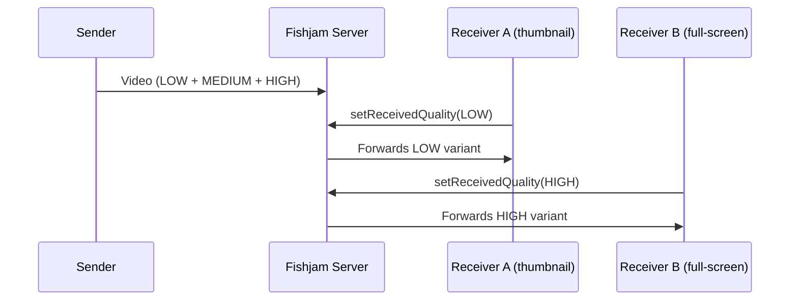

# Simulcast

_Multi-quality video streaming for adaptive bandwidth and layout-aware rendering_

Simulcast allows a video sender to encode and transmit the same video at multiple quality levels (variants) simultaneously. Each receiver independently chooses which variant to receive, enabling adaptive quality based on network conditions, UI layout, or user preference.

## Why Simulcast?

Without simulcast, every receiver gets the same video quality. This creates a trade-off: send high quality (wastes bandwidth for small thumbnails) or send low quality (degrades the experience for full-screen viewers).

Simulcast eliminates this trade-off. A sender publishes multiple variants, and each receiver requests only the quality it needs:

- A **thumbnail grid** can request low quality for all participants
- A **spotlight view** can request high quality for the active speaker and low for everyone else
- A participant on a **slow connection** can request medium quality regardless of UI layout

## Quality Variants

Three predefined quality tiers are available via the `Variant` enum:

| Variant                  | Meaning                     |
| ------------------------ | --------------------------- |
| `Variant.VARIANT_LOW`    | Low quality / resolution    |
| `Variant.VARIANT_MEDIUM` | Medium quality / resolution |
| `Variant.VARIANT_HIGH`   | High quality / resolution   |

## How It Works

1. The **sender** encodes the camera feed into up to three variants and sends all of them to the Fishjam server.
2. The **server** receives all variants but only forwards the one each receiver has requested.
3. Each **receiver** calls `setReceivedQuality` on a remote track to tell the server which variant it wants. The receiver can change this at any time.

## Sender Configuration

The sender controls which variants to publish via the `sentQualities` option in `FishjamProvider`'s `videoConfig`:

- **All variants** (default): Omit `sentQualities` or pass `[Variant.VARIANT_LOW, Variant.VARIANT_MEDIUM, Variant.VARIANT_HIGH]`
- **Subset**: Pass only the variants you need, e.g. `[Variant.VARIANT_LOW, Variant.VARIANT_HIGH]`
- **Disabled**: Pass `false` to send a single quality stream (no simulcast)

## Receiver Quality Selection

Remote tracks expose a `setReceivedQuality` method. This is only available on **remote** peer tracks. Your own local tracks don't have it, since you don't "receive" your own video.

The `RemoteTrack` type (exported from both `@fishjam-cloud/react-client` and `@fishjam-cloud/react-native-client`) extends the base `Track` type with a `setReceivedQuality(quality: Variant)` method.

When you call `setReceivedQuality`, the server switches which variant it forwards for that track. The change takes effect almost immediately.

## When to Use Simulcast

Simulcast is most valuable when:

- Your app has **multiple layout modes** (grid, spotlight, picture-in-picture)
- Participants have **varying network conditions**
- You want to **reduce bandwidth** for participants viewing many small thumbnails
- You're building **adaptive quality** that responds to UI state

For simple 1:1 calls where both sides always show full-screen video, simulcast adds encoding overhead without much benefit. Consider disabling it with `sentQualities: false`.

## See also

- [Simulcast how-to guide](../how-to/features/simulcast): step-by-step implementation
- [Architecture](./architecture): how Fishjam routes media
