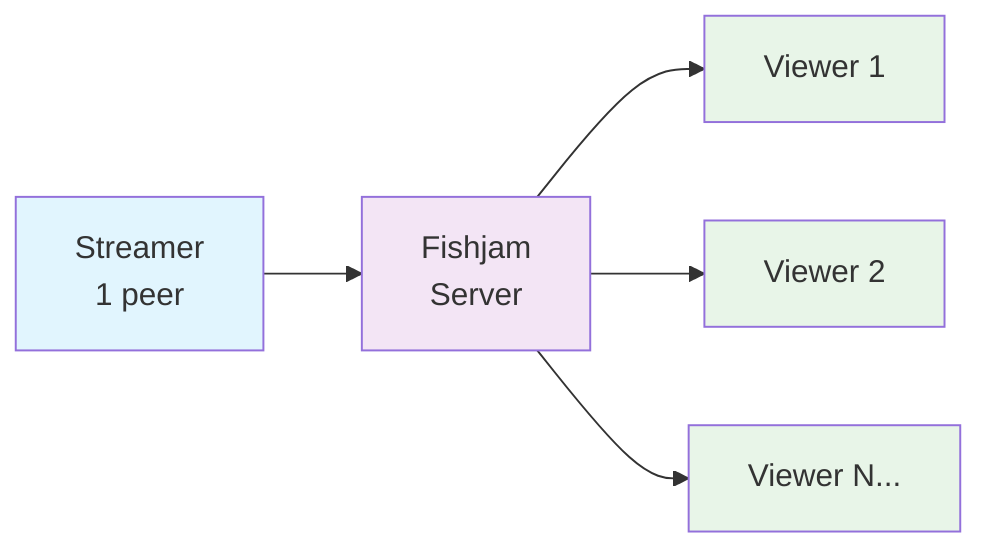

import Tabs from "@theme/Tabs";
import TabItem from "@theme/TabItem";
import ConfigurePermissions from "./_components/configure-permissions.mdx";

# Livestreaming

This guide shows you how to implement livestreaming in React Native using Fishjam. You'll learn how to broadcast video streams and receive them in your app.

## 📋 Prerequisites

Before you begin, ensure you have:

- **React Native project** set up with Expo or bare React Native
- **Fishjam SDK** installed: `npm install @fishjam-cloud/react-native-client`
- **A room of `livestream` type** created in Fishjam
- **Camera and microphone permissions** [configured](/how-to/react-native/installation#step-2-configure-app-permissions)

See the [livestreaming overview](/how-to/features/livestreaming) for more information about Fishjam's livestreaming in general.

## 🏗️ Architecture Overview

Fishjam livestreaming follows a **one-to-many** broadcasting model:



**Key characteristics:**

- **One streamer** per room (broadcasts video/audio)
- **Unlimited viewers** per room (receive the stream)
- **Single video track** and **single audio track** per stream

## 📱 Broadcasting a Stream

### Prerequisites

Before you start broadcasting, you need:

- Camera and microphone permissions configured
- A room of `livestream` type
- A [peer token](/explanation/glossary#peer-token) for that room

### Setup Steps

1. **Join the room** using the [connection guide](/how-to/react-native/connecting)
2. **Start streaming** following the [streaming guide](/how-to/react-native/start-streaming)

:::note
Livestreaming rooms accept only one video track and one audio track. Fishjam ignores additional tracks to maintain broadcast quality.
:::

## 📺 Receiving a Stream

### Prerequisites

To receive a stream, you need:

- An active streamer in a livestream room
- A [viewer token](/how-to/features/livestreaming) for that room

### Setup Steps

1. **Use the `useLivestream` hook** to connect to the stream
2. **Pass the viewer token** to the `connect` method
3. **Display the stream** using the `LivestreamView` component

The `LivestreamView` automatically renders the video once the connection establishes.

## 🖼️ Picture-in-Picture Support

The `LivestreamView` component supports Picture-in-Picture (PiP) mode. Users can continue watching the stream while using other apps.

### Enable PiP Support

<Tabs>
<TabItem value="ios" label="iOS">

Add this configuration to your `app.json`:

```json
{
  "expo": {
    "ios": {
      "supportsPictureInPicture": true
    }
  }
}
```

</TabItem>
<TabItem value="android" label="Android">

Add this configuration to your `app.json`:

```json
{
  "expo": {
    "android": {
      "supportsPictureInPicture": true
    }
  }
}
```

</TabItem>
</Tabs>

### Configure PiP Behavior

The `LivestreamView` component accepts these PiP-related props:

| Prop           | Type    | Description                                               |
| -------------- | ------- | --------------------------------------------------------- |
| `pipEnabled`   | boolean | Enables Picture-in-Picture mode                           |
| `autoStartPip` | boolean | Starts PiP automatically when app backgrounds             |
| `autoStopPip`  | boolean | Stops PiP automatically when app foregrounds (iOS only)   |
| `pipSize`      | object  | Sets PiP window size with `width` and `height` properties |

:::note
Android only supports PiP when the app is in the background. The `autoStopPip` prop is always enabled on Android.
:::

### Basic PiP Usage

```tsx
import React from "react";
import { LivestreamView } from "@fishjam-cloud/react-native-client";

<LivestreamView
  pipEnabled
  autoStartPip
  autoStopPip
  pipSize={{ width: 1920, height: 1080 }}
/>;
```

### Control PiP Programmatically

You can control PiP behavior using the component ref:

```tsx
import React, { useRef } from "react";
import {
  LivestreamView,
  LivestreamViewRef,
} from "@fishjam-cloud/react-native-client";

function LivestreamPlayer() {
  const livestreamRef = useRef<LivestreamViewRef>(null);

  // Control PiP programmatically
  livestreamRef.current?.startPip();
  livestreamRef.current?.stopPip();
  livestreamRef.current?.togglePip();

  return (
    <LivestreamView
      ref={livestreamRef}
      style={{ width: "90%", aspectRatio: 1, backgroundColor: "black" }}
    />
  );
}
```

### Platform Differences

| Platform | Foreground Support | Background Support | Auto-stop Behavior               |
| -------- | ------------------ | ------------------ | -------------------------------- |
| iOS      | ✅ Yes             | ✅ Yes             | Controlled by `autoStopPip` prop |
| Android  | ❌ No              | ✅ Yes             | Always enabled                   |

## 💻 Complete Examples

These examples show complete implementations for both streaming and viewing.

:::info
This guide assumes you completed either the [Quick Setup](/tutorials/react-native-quick-start) or [Installation](/how-to/react-native/installation) guide.
:::

### Required Permissions

<details>
<summary>Configure permissions before livestreaming</summary>

<ConfigurePermissions />

</details>

### Streamer Example

This component automatically starts streaming when mounted:

```tsx
import React, { useEffect } from "react";
import {
  useCamera,
  useConnection,
  VideoPreviewView,
} from "@fishjam-cloud/react-native-client";

const ROOM_MANAGER_ID = "";

export default function Streamer() {
  const { prepareCamera } = useCamera();
  const { joinRoom, leaveRoom } = useConnection();

  useEffect(() => {
    const startStreaming = async () => {
      console.log("Getting room details...");
      const { url, peerToken } = await getRoomDetails(
        "TestRoom",
        "StreamerUserName",
      );

      console.log("Preparing camera...");
      await prepareCamera({ cameraEnabled: true });

      await joinRoom({ url, peerToken });
      console.log("Streaming...");
    };

    startStreaming();
    return () => {
      leaveRoom();
    };
  }, [prepareCamera, joinRoom, leaveRoom]);

  return (
    <VideoPreviewView
      style={{ width: "90%", aspectRatio: 1, alignSelf: "center" }}
    />
  );
}

async function getRoomDetails(roomName: string, peerName: string) {
  // This will work ONLY for the Sandbox App
  const response = await fetch(
    `https://fishjam.io/api/v1/connect/${ROOM_MANAGER_ID}/room-manager/?roomName=${roomName}&peerName=${peerName}&roomType=livestream`,
  );
  return response.json();
}
```

### Viewer Example

This component receives and displays a livestream:

```tsx
import React, { useCallback, useEffect } from "react";
import { View } from "react-native";
import {
  useLivestream,
  LivestreamView,
} from "@fishjam-cloud/react-native-client";

const ROOM_MANAGER_ID = "";

export function Receiver() {
  const { connect, disconnect } = useLivestream();

  const handleConnect = useCallback(async () => {
    try {
      console.log("Getting stream details...");
      const { token } = await getViewerToken("TestRoom");
      await connect(`https://fishjam.io/api/v1/live`, token);
      console.log("Receiving...");
    } catch (err) {
      console.log(err);
    }
  }, [connect]);

  useEffect(() => {
    handleConnect();

    return () => {
      disconnect();
    };
  }, [handleConnect, disconnect]);

  return (
    <View style={{ flex: 1, justifyContent: "center", alignItems: "center" }}>
      <LivestreamView
        style={{ width: "90%", aspectRatio: 1, backgroundColor: "black" }}
      />
    </View>
  );
}

async function getViewerToken(roomName: string) {
  // This will work ONLY for the Sandbox App
  // see https://fishjam.io/docs/livestreaming
  const response = await fetch(
    `https://fishjam.io/api/v1/connect/${ROOM_MANAGER_ID}/room-manager/${roomName}/broadcast-viewer-token`,
  );
  return response.json();
}
```

## 🚨 Troubleshooting

### Common Issues

**Stream not appearing for viewers:**

- Verify the streamer successfully joined the room. If no one is streaming, there is nothing to join to.
- Ensure the room type is `livestream`, when streaming.

**PiP not working:**

- Confirm PiP support is enabled in `app.json`
- Check that `pipEnabled` prop is set to `true`

## 📚 Additional Resources

- [Livestreaming Overview](/how-to/features/livestreaming) - Learn about Fishjam's livestreaming architecture
- [Connection Guide](/how-to/react-native/connecting) - Detailed connection setup
- [Streaming Guide](/how-to/react-native/start-streaming) - Advanced streaming configuration
- [API Reference](/api/mobile/functions/useLivestream) - Complete API documentation
