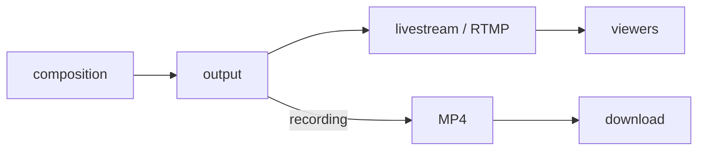

import Tabs from "@theme/Tabs";
import TabItem from "@theme/TabItem";

# Record a composition output

A **composition recording** mirrors an output that a composition already publishes: it captures that output's media from the moment it is created and stores it as an MP4 file. Use it to keep a copy of a live stream you are already running. To record something that is not published live, or to record a layout different from the live stream, [record with a template](./record-with-a-template) instead.

Compositions are managed through the [Composition API](./../../api/reference#compositions), while recordings are managed through the [Fishjam Server API](./../../api/reference#server): a single call there starts the recording, and Fishjam controls the capture inside the composition on your behalf. The [Recordings](./../../explanation/recordings) article explains this model and the recording lifecycle in more detail.



## Prerequisites

A running composition with its inputs registered, a livestream for it to publish to, and the livestream's streamer token. The [tutorial](./../../tutorials/compositions) sets these up in Steps 1 to 3; stop before Step 4, which registers the same output as Step 1 below.

```bash
export FISHJAM_URL="https://fishjam.io/api/v1/connect/<YOUR_FISHJAM_ID>"
export TOKEN="<YOUR_MANAGEMENT_TOKEN>"
export COMPOSITION="<COMPOSITION_ID>"
export STREAMER_TOKEN="<STREAMER_TOKEN>"
```

Step 1 uses the `CompositionClient`; every recording call from Step 2 onwards is a method on the `FishjamClient` of the [JS and Python server SDKs](./../backend/server-setup). Both are shown in the language tabs.

## Step 1: Register the output to record

A recording attaches to an output, so the composition must first have an output whose scene will be recorded. Register it like any other output. Every output publishes to a destination, so the output you record is also a live stream: in this example, `main` publishes to your livestream over WHIP, with the tutorial's two inputs side by side.

<Tabs groupId="language">
  <TabItem value="ts" label="Typescript">

```ts
import {
  CompositionClient,
  CompositionId,
  FishjamClient,
  InputId,
  OutputId,
} from "@fishjam-cloud/js-server-sdk";

const compositionClient = new CompositionClient({ managementToken: "" });
const fishjamClient = new FishjamClient({ fishjamId: "", managementToken: "" });
const compositionId = "" as CompositionId;
const outputId = "" as OutputId;
const streamerToken = "";
const race = "race" as InputId;
const player = "player" as InputId;

// ---cut---
await compositionClient.registerWhipOutput(compositionId, outputId, {
  endpointUrl: fishjamClient.livestreamWhipUrl(),
  bearerToken: streamerToken,
  video: {
    resolution: { width: 1280, height: 720 },
    initial: {
      root: {
        type: "tiles",
        children: [
          { type: "input_stream", inputId: race },
          { type: "input_stream", inputId: player },
        ],
      },
    },
  },
  audio: { initial: { inputs: [{ inputId: player }] } },
});
```

  </TabItem>
  <TabItem value="python" label="Python">

```python
from fishjam.composition import (
    AudioScene,
    AudioSceneInput,
    InputStream,
    InputStreamType,
    OutputWhipAudioOptions,
    OutputWhipVideoOptions,
    Resolution,
    Tiles,
    TilesType,
    VideoScene,
)

composition_client.register_whip_output(
    composition_id,
    "main",
    endpoint_url=fishjam_client.livestream_whip_url(),
    bearer_token=streamer_token,
    video=OutputWhipVideoOptions(
        resolution=Resolution(width=1280, height=720),
        initial=VideoScene(
            root=Tiles(
                type_=TilesType.TILES,
                children=[
                    InputStream(
                        type_=InputStreamType.INPUT_STREAM, input_id="race"
                    ),
                    InputStream(
                        type_=InputStreamType.INPUT_STREAM, input_id="player"
                    ),
                ],
            )
        ),
    ),
    audio=OutputWhipAudioOptions(
        initial=AudioScene(inputs=[AudioSceneInput(input_id="player")])
    ),
)
```

  </TabItem>
  <TabItem value="curl" label="curl">

```bash
curl -X POST "https://rtc.fishjam.io/api/composition/$COMPOSITION/output/main/register" \
  -H "Authorization: Bearer $TOKEN" \
  -H "Content-Type: application/json" \
  -d @- <<EOF
{
  "type": "whip_client",
  "endpoint_url": "https://fishjam.io/api/v1/live/api/whip",
  "bearer_token": "$STREAMER_TOKEN",
  "video": {
    "resolution": { "width": 1280, "height": 720 },
    "initial": {
      "root": {
        "type": "tiles",
        "children": [
          { "type": "input_stream", "input_id": "race" },
          { "type": "input_stream", "input_id": "player" }
        ]
      }
    }
  },
  "audio": { "initial": { "inputs": [{ "input_id": "player" }] } }
}
EOF
```

  </TabItem>
</Tabs>

The recording captures this scene and every subsequent update sent to `main`. If your composition already has the output you want to record, for example the templated output from [Compose a Fishjam room](./../compositions/compose-a-fishjam-room), skip to Step 2. See [Choose inputs and outputs](./../compositions/inputs-and-outputs) for the other output types.

## Step 2: Start the recording

Specify the composition and the output from Step 1 in `source`:

<Tabs groupId="language">
  <TabItem value="ts" label="Typescript">

```ts
import { FishjamClient } from "@fishjam-cloud/js-server-sdk";

const fishjamClient = new FishjamClient({
  fishjamId: process.env.FISHJAM_ID!,
  managementToken: process.env.MANAGEMENT_TOKEN!,
});
// ---cut---
const recording = await fishjamClient.createCompositionRecording({
  source: {
    compositionURL: "https://rtc.fishjam.io/api/composition/<COMPOSITION_ID>",
    outputId: "main",
  },
  metadata: { show: "weekly-standup" },
});
```

The response returns the recording with status `active`; capture has already started.

  </TabItem>
  <TabItem value="python" label="Python">

```python
import os

from fishjam import FishjamClient
from fishjam.recording import CompositionSource

fishjam_client = FishjamClient(
    fishjam_id=os.environ["FISHJAM_ID"],
    management_token=os.environ["MANAGEMENT_TOKEN"],
)

recording = fishjam_client.create_composition_recording(
    source=CompositionSource(
        composition_url="https://rtc.fishjam.io/api/composition/<COMPOSITION_ID>",
        output_id="main",
    ),
    metadata={"show": "weekly-standup"},
)
```

The response returns the recording with status `active`; capture has already started.

  </TabItem>
  <TabItem value="curl" label="curl">

```bash
curl -X POST "$FISHJAM_URL/recordings" \
  -H "Authorization: Bearer $TOKEN" \
  -H "Content-Type: application/json" \
  -d "{
    \"source\": {
      \"compositionURL\": \"https://rtc.fishjam.io/api/composition/$COMPOSITION\",
      \"outputId\": \"main\"
    },
    \"metadata\": { \"show\": \"weekly-standup\" }
  }"
```

The response returns the recording with status `active`; capture has already started. Save its id from `data.id`:

```bash
export RECORDING="<RECORDING_ID>"
```

  </TabItem>
</Tabs>

Note the following:

- The recording mirrors the output it captures: the same layout and resolution, including every scene update. The file is encoded separately from the live stream. To record at a different resolution than the live output, add `scaleRatio` to `source`: `0.5` records at half the output's resolution, and values above `1` upscale. The default is `1`.
- An output can have at most one recording at a time. To record the same output again, wait until the current recording is no longer `active`.
- `metadata` is optional and free-form. It is returned with the recording and can be used to filter recordings later.

## Step 3: Stop and download the recording

Stopping, checking the status, downloading the MP4, and deleting the recording work the same for every recording. Continue with [Manage recordings](./manage-recordings).
