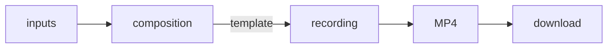

import Tabs from "@theme/Tabs";
import TabItem from "@theme/TabItem";

# Record with a template

A **template recording** renders a React [template](./../compositions/write-and-deploy-a-template) directly into an MP4 file. The template describes what the recording shows, and the recording is the only thing it produces: there is no output to register and no live stream to publish to.



The template runs inside a composition, which holds the inputs it renders. The [Recordings](./../../explanation/recordings) article explains how template recordings relate to compositions and to recordings of an existing output.

## Prerequisites

- A running composition with inputs. Either register inputs yourself, as in [Steps 1 and 2 of the compositions tutorial](./../../tutorials/compositions#step-1-create-a-composition), or forward a Fishjam room into it and start the composition, as in [Steps 4 and 5 of Compose a Fishjam room](./../compositions/compose-a-fishjam-room#step-4-forward-the-room-into-the-composition). A composition created with `autostart: false` renders nothing until it is started. You do not need a livestream or any other output.
- A template project scaffolded with the composition CLI (see [Write and deploy a template](./../compositions/write-and-deploy-a-template#scaffold-a-project)).

```bash
export FISHJAM_URL="https://fishjam.io/api/v1/connect/<YOUR_FISHJAM_ID>"
export TOKEN="<YOUR_MANAGEMENT_TOKEN>"
export COMPOSITION="<COMPOSITION_ID>"
```

Every recording call is a method on the `FishjamClient` of the [JS and Python server SDKs](./../backend/server-setup), shown in the language tabs below.

## Step 1: Write and bundle the template

A recording template is written exactly like the template of an output. This one tiles every input that is playing, so the recording follows inputs as they come and go:

```tsx
// @jsx: react-jsx
// ---cut-before---
import {
  InputStream,
  Rescaler,
  Tiles,
  View,
  useInputStreams,
} from "@swmansion/smelter";

export default function App() {
  const inputs = Object.values(useInputStreams());
  const playing = inputs.filter((input) => input.videoState === "playing");

  return (
    <View style={{ backgroundColor: "#0b1020ff" }}>
      <Tiles style={{ padding: 8 }}>
        {playing.map((input) => (
          <Rescaler key={input.inputId}>
            <InputStream inputId={input.inputId} />
          </Rescaler>
        ))}
      </Tiles>
    </View>
  );
}
```

The template decides everything the recording shows. It can use the room hooks from `@fishjam-cloud/composition`, such as `usePeers()`, to render a forwarded room (see [Compose a Fishjam room](./../compositions/compose-a-fishjam-room#step-2-write-a-room-aware-template)), and the `eventBus` to react to [events you send to the composition](./../compositions/drive-a-template-with-events).

Build the bundle:

```bash npm2yarn
npm run build
```

The bundle, `dist/App.js`, can weigh at most 1 MiB.

## Step 2: Start the recording

Pass the composition in `source` and the bundle alongside it:

<Tabs groupId="language">
  <TabItem value="ts" label="Typescript">

```ts
import { FishjamClient } from "@fishjam-cloud/js-server-sdk";

const fishjamClient = new FishjamClient({
  fishjamId: process.env.FISHJAM_ID!,
  managementToken: process.env.MANAGEMENT_TOKEN!,
});
// ---cut---
const recording = await fishjamClient.createTemplateRecording(
  {
    source: {
      compositionURL: "https://rtc.fishjam.io/api/composition/<COMPOSITION_ID>",
      resolution: { width: 1280, height: 720 },
    },
    metadata: { show: "weekly-standup" },
  },
  "dist/App.js",
);
```

The template is either a path to the bundle or a `Blob` with its contents. The response returns the recording with status `active`; capture has already started.

  </TabItem>
  <TabItem value="python" label="Python">

```python
import os

from fishjam import FishjamClient
from fishjam.recording import TemplateSource, TemplateSourceResolution

fishjam_client = FishjamClient(
    fishjam_id=os.environ["FISHJAM_ID"],
    management_token=os.environ["MANAGEMENT_TOKEN"],
)

recording = fishjam_client.create_template_recording(
    source=TemplateSource(
        composition_url="https://rtc.fishjam.io/api/composition/<COMPOSITION_ID>",
        resolution=TemplateSourceResolution(width=1280, height=720),
    ),
    template="dist/App.js",
    metadata={"show": "weekly-standup"},
)
```

The template is either a path to the bundle or its contents as `bytes`. The response returns the recording with status `active`; capture has already started.

  </TabItem>
  <TabItem value="curl" label="curl">

A template recording is created with a `multipart/form-data` request: the configuration in a `config` part and the bundle in a `template` part.

```bash
CONFIG=$(cat <<EOF
{
  "source": {
    "compositionURL": "https://rtc.fishjam.io/api/composition/$COMPOSITION",
    "resolution": { "width": 1280, "height": 720 }
  },
  "metadata": { "show": "weekly-standup" }
}
EOF
)

curl -X POST "$FISHJAM_URL/recordings" \
  -H "Authorization: Bearer $TOKEN" \
  -F "config=$CONFIG;type=application/json" \
  -F "template=@dist/App.js"
```

The response returns the recording with status `active`; capture has already started. Save its id from `data.id`:

```bash
export RECORDING="<RECORDING_ID>"
```

  </TabItem>
</Tabs>

Note the following:

- `resolution` sets the size the template is rendered at. It defaults to 1280x720, has to be even on both sides, and can be at most 3840x2160.
- `audio` controls whether the recording captures audio. It defaults to `true`; set it to `false` for a video-only file.
- A composition can run several template recordings at once, each with its own template.
- `metadata` is optional and free-form. It is returned with the recording and can be used to filter recordings later.

## Step 3: Stop and download the recording

A template recording captures until you stop it or its composition ends. A composition ends when you delete it, or when it [cleans itself up](./../../explanation/compositions#cost-and-lifecycle) after five minutes without input media, so keep inputs flowing for as long as you want to record.

Stopping, checking the status, downloading the MP4, and deleting the recording work the same for every recording. Continue with [Manage recordings](./manage-recordings).
