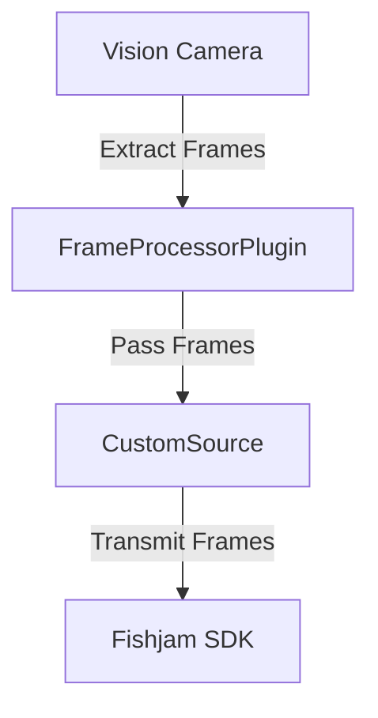

import Tabs from "@theme/Tabs";
import TabItem from "@theme/TabItem";
import ConfigurePermissions from "../_components/configure-permissions.mdx";

# RN Vision Camera Example

This example demonstrates how to implement a CustomSource using [VisionCamera](https://github.com/mrousavy/react-native-vision-camera) to stream content directly from your device's camera to the Fishjam SDK.

:::tip

Check out our [**complete example implementation**](https://github.com/fishjam-cloud/mobile-client-sdk/tree/3473afd51ff3a4dc5849463d1ff8a4028e428739/examples/vision-camera) using [VisionCamera](https://github.com/mrousavy/react-native-vision-camera)

:::

## Overview

There are two main components to implement:

1. **Create a Frame Processor Plugin**:

   - This plugin extracts frames from Vision Camera and passes them to the Fishjam SDK.
   - For more details on frame processor plugins, check out the Vision Camera documentation [here](https://react-native-vision-camera.com/docs/guides/frame-processors-plugins-overview).

2. **Create a CustomSource**:

   - This component sends the camera frames to Fishjam.
   - Check out the [CustomSource overview](./overview.mdx) to learn more about this concept.

## How does it work?

The `FrameProcessorPlugin` and `CustomSource` work together to process and transmit video frames from the Vision Camera to the Fishjam SDK. Here's a clearer breakdown of their roles:

1. **FrameProcessorPlugin**:

   - Extracts frames from the Vision Camera.
   - Processes each frame and prepares it for transmission.
   - Passes the processed frames to the `CustomSource`.

2. **CustomSource**:
   - Receives frames from the `FrameProcessorPlugin`.
   - Transmits these frames to the Fishjam SDK.
   - Ensures frames are in the correct format for the SDK.

### Diagram

Below is a diagram illustrating the flow of frames from the Vision Camera to the Fishjam SDK:



This diagram shows the flow of data from the Vision Camera through the `FrameProcessorPlugin` to the `CustomSource`, and finally to the Fishjam SDK.

### Examples

Here are examples illustrating how to implement the above flow for iOS and Android.

<Tabs groupId="os-type">

  <TabItem value="ios" label="iOS Example">

Follow these steps to implement Vision Camera as a custom source on iOS:

1. Create a CustomSource class that implements the required protocol:

```swift
import FishjamCloudClient

class WebrtcVisionCameraCustomSource: CustomSource {
  var delegate: CustomSourceDelegate?

  let isScreenShare = false
  let metadata = ["type":"camera"].toMetadata()
  let videoParameters = VideoParameters.presetFHD43
}
```

2. Create a FrameProcessorPlugin that will extract frames from Vision Camera and pass them to Fishjam SDK:

```swift
import VisionCamera

public class WebrtcFrameProcessorPlugin: FrameProcessorPlugin {
  static var currentSource: WebrtcVisionCameraCustomSource?

  public override func callback(_ frame: Frame, withArguments arguments: [AnyHashable : Any]?) -> Any {
    if let customSource = WebrtcFrameProcessorPlugin.currentSource {
      customSource.delegate?.customSource(customSource, didOutputSampleBuffer: frame.buffer, rotation: .ninety)
    }
    return frame
  }
}
```

3. Register the FrameProcessorPlugin with Vision Camera:

   - Follow the official documentation on registering plugins [here](https://react-native-vision-camera.com/docs/guides/frame-processors-plugins-ios).

4. Register the CustomSource with Fishjam SDK to create a new track:

```swift
let source = WebrtcVisionCameraCustomSource()

WebrtcFrameProcessorPlugin.currentSource = source

try await RNFishjamProxy.add(customSource: source)
```

  </TabItem>
  <TabItem value="android" label="Android Example">

Follow these steps to implement Vision Camera as a custom source on Android:

1. Create a CustomSource class that implements the required interface:

```kotlin
import com.fishjamcloud.client.models.CustomSource
import com.fishjamcloud.client.models.CustomSourceConsumer
import com.fishjamcloud.client.models.VideoParameters
import com.fishjamcloud.client.models.Metadata

class WebrtcVisionCameraCustomSource: CustomSource {
  override val isScreenShare = false
  override val metadata: Metadata = mapOf("type" to "camera")
  override val videoParameters = VideoParameters.presetFHD43

  var consumer: CustomSourceConsumer? = null
    private set

  override fun initialize(consumer: CustomSourceConsumer) {
    this.consumer = consumer
  }
}
```

2. Create a FrameProcessorPlugin that will extract frames from Vision Camera and pass them to Fishjam SDK:

```kotlin
import com.mrousavy.camera.frameprocessors.Frame
import com.mrousavy.camera.frameprocessors.FrameProcessorPlugin
import com.mrousavy.camera.frameprocessors.VisionCameraProxy

class WebrtcFrameProcessorPlugin(proxy: VisionCameraProxy, options: Map<String, Any>?): FrameProcessorPlugin() {
  companion object {
    var currentSource: WebrtcVisionCameraCustomSource? = null
  }

  override fun callback(frame: Frame, arguments: Map<String, Any>?): Frame {
    currentSource?.consumer?.onImageProxyCaptured(frame.imageProxy)
    return frame
  }
}
```

3. Register the FrameProcessorPlugin with Vision Camera:

   - Follow the official documentation on registering plugins [here](https://react-native-vision-camera.com/docs/guides/frame-processors-plugins-android).

4. Register the CustomSource with Fishjam SDK to create a new track:

```kotlin
val source = WebrtcVisionCameraCustomSource()

WebrtcFrameProcessorPlugin.currentSource = source

RNFishjamClient.createCustomSource(source)
```

    </TabItem>

</Tabs>

#### Usage

Depending on your React Native setup, create an interface for Javascript to interact with this code. If you're using Expo, we recommend using [Expo Modules](https://docs.expo.dev/modules/overview/). If you're using a bare React Native setup, we recommend using [Turbo Modules](https://reactnative.dev/docs/turbo-native-modules-introduction).
