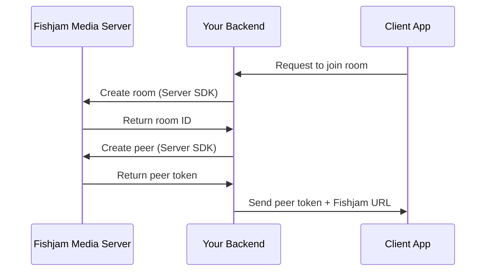
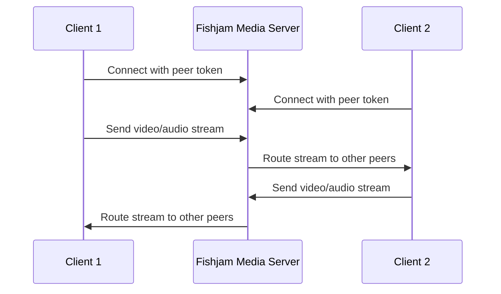

# Fishjam Architecture

_Understanding how Fishjam works under the hood_

This document explains the technical architecture of Fishjam and how data flows through the system.

## High-level Architecture

Streaming with Fishjam is simple: you create a room, add peers to it, and start streaming. Below is a high-level overview of how Fishjam works.

## Components Overview

### 1. Your Backend Server

Your application's backend server is responsible for:

- Authenticating users
- Creating rooms using Fishjam Server SDKs
- Generating peer tokens for clients
- Managing room lifecycle and permissions

### 2. Fishjam Media Server

The Fishjam Media Server is the core infrastructure component that:

- Routes audio and video streams between participants
- Handles WebRTC negotiations and connections
- Manages different room types (conference, audio-only, livestream)
- Processes and transcodes media when needed
- Enforces security policies and token validation

### 3. Client Applications

Client applications (React Native, React) use Fishjam Client SDKs to:

- Connect to rooms using peer tokens
- Send and receive audio/video streams
- Handle device management (cameras, microphones)
- Manage connection state and reconnections

## Data Flow

### 1. Room Creation Flow

### 2. Media Streaming Flow

## Next Steps

To understand different room types in detail, see [Room Types Explained](../explanation/room-types).

To learn about security and token management, see [Security & Token Model](../explanation/security-tokens).

Ready to implement? Start with our tutorials:

- [React Native Quick Start](../tutorials/react-native-quick-start)
- [Backend Quick Start](../tutorials/backend-quick-start)
